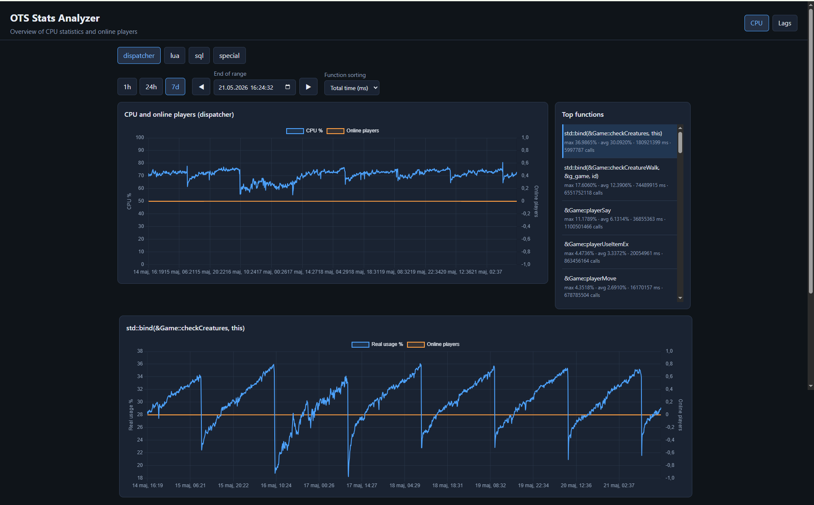

# OTS Stats Analyzer

Tool to import [OTS Statistics](https://otland.net/threads/how-to-read-ots-statistics-logs.283722/) logs into SQLite and a simple website UI for analysis.



# Installation instruction

In the file [doc/INSTALL.md](doc/INSTALL.md) is an installation instruction for Linux Ubuntu 22.04.

### Requirements

- PHP 8.1+
- Composer

### Setup

```bash
composer install
```

Place log files in `data/` (flat layout):

- `dispatcher.log`, `dispatcher_slow.log`, `dispatcher_very_slow.log`
- `lua.log`, `lua_slow.log`, `lua_very_slow.log`
- `sql.log`, `sql_slow.log`, `sql_very_slow.log`
- `special.log`, `special_slow.log`, `special_very_slow.log`

You can also drop **daily dump files** alongside the standard names, e.g. `dispatcher_2026-05-20.log`, `dispatcher_slow_2026-05-20.log`. Each file is tracked separately in `import_files`.

If you **replace** a log file under the same path (e.g. a new daily export overwrites `dispatcher.log`), the importer detects the change by the first line hash and re-imports the whole file instead of resuming from an old byte offset.

## Import performance

The importer optimizes bulk loads:

- Secondary indexes are dropped during import and rebuilt once at the end (much faster inserts).
- One SQLite transaction per log file, with checkpoints every 32 MiB (resume after interrupt).
- Slow events use multi-row INSERTs (thousands of rows per SQL statement) with cached prepared statements.
- Description IDs are resolved in bulk per batch (not one DB round-trip per log line).

If you stop import with Ctrl+C, rerun the same command — it continues from the last checkpoint instead of re-reading the whole file.

### Tuning (environment variables)

| Variable | Default | Effect |
|----------|---------|--------|
| `OTS_BATCH_SIZE` | `20000` | Rows buffered in RAM before flush to SQLite |
| `OTS_INSERT_CHUNK_ROWS` | `250` | Rows per SQL INSERT (keep near 250; very large values slow PHP PDO) |
| `OTS_READ_MODE` | `stream` | `stream` (line-by-line), `chunk` (64 MiB fread blocks), or `file` (load whole file if ≤ `OTS_MAX_FILE_LOAD_BYTES`) |
| `OTS_READ_CHUNK_BYTES` | `67108864` | fread block size for `chunk` mode |
| `OTS_MAX_FILE_LOAD_BYTES` | `67108864` | Max file size for `file` mode |
| `OTS_MEMORY_LIMIT` | `32G` | PHP `memory_limit` |
| `OTS_IMPORT_DAYS` | `30` | Import only log records from the last N days (`0` = no limit) |
| `OTS_SQLITE_AGGRESSIVE` | off | Set to `1` for larger SQLite cache/mmap and `journal_mode=MEMORY` during import |

Example for a machine with plenty of RAM (full import of large `*_slow.log` files):

```bash
set OTS_BATCH_SIZE=50000
set OTS_READ_MODE=chunk
set OTS_SQLITE_AGGRESSIVE=1
php bin/import.php import --data-dir=data
```

## Import

First run (imports last 30 days by default; uses binary search on large rolling logs to skip older data):

```bash
php bin/import.php import --data-dir=data --db=var/ots-stats.sqlite
```

Incremental run (only new appended lines on unchanged files; deduplicates last 7 days via RAM):

```bash
php bin/import.php import --data-dir=data --db=var/ots-stats.sqlite
```

Full historical import (no date limit):

```bash
php bin/import.php import --days=0 --data-dir=data --db=var/ots-stats.sqlite
```

Progress is printed to stderr every 3 seconds (bytes, speed, ETA per file and total):

```bash
php bin/import.php import --progress-interval=3 2>import-progress.log
```

Options:

- `--data-dir` — log directory (default: `data`)
- `--db` — SQLite path (default: `var/ots-stats.sqlite`)
- `--days=30` — import only records from the last N days (`0` = no limit)
- `--dedup-days=7` — load dedup keys from DB for this many days (incremental re-import)
- `--memory-limit=32G` — PHP memory limit
- `--progress-interval=0` — disable progress output

## Status

```bash
php bin/import.php status
```

## Tests

Run:
```bash
vendor/bin/phpunit
```

## Web UI

After importing logs, start the built-in PHP server with the project router:

```bash
php -S localhost:8080 -t public public/router.php
```

Open [http://localhost:8080](http://localhost:8080) in a browser.

The UI provides:

- Overview chart of CPU usage and players online (dispatcher) or source CPU usage (lua/sql/special)
- Time range: 1h, 24h, 7d — anchored at the latest data by default, with datetime picker and history navigation
- Top functions list per source with sorting by max/avg CPU or total time
- Per-function CPU chart with players online correlation

JSON API is available at `/api.php`:

| Action | Parameters |
|--------|------------|
| `meta` | — |
| `overview` | `range`, `end`, `source` |
| `top-functions` | `range`, `end`, `source`, `sort`, `limit` |
| `function-series` | `range`, `end`, `description_id` |

Database path follows `OTS_DB_PATH` (default: `var/ots-stats.sqlite`).

Production: point nginx/Apache `root` to `public/` and expose `api.php` from the project root.

## Database

SQLite schema in `database/schema.sql`. Main tables:

- `cpu_reports` / `cpu_stats` — 30-second CPU usage reports from `*.log`
- `slow_events` — single slow executions from `*_slow.log` and `*_very_slow.log`
- `descriptions` — normalized function/SQL/script names
- `import_files` — per-file byte offset, first-line hash, and resume state
- `cpu_source_usage_agg` — pre-aggregated per-source overview (30s buckets); rebuild on import
